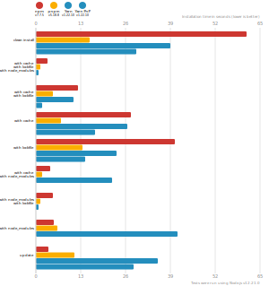

# Benchmarks of JavaScript Package Managers

This benchmark compares the performance of [npm](https://github.com/npm/cli), [pnpm](https://github.com/pnpm/pnpm) and [Yarn](https://github.com/yarnpkg/yarn) (both regular and PnP variant).

Here's a quick explanation of how these tests could apply to the real world:

- `clean install`: How long it takes to run a totally fresh install: no lockfile present, no packages in the cache, no `node_modules` folder.
- `with cache`, `with lockfile`, `with node_modules`: After the first install is done, the install command is run again.
- `with cache`, `with lockfile`: When a repo is fetched by a developer and installation is first run.
- `with cache`: Same as the one above, but the package manager doesn't have a lockfile to work from.
- `with lockfile`: When an installation runs on a CI server.
- `with cache`, `with node_modules`: The lockfile is deleted and the install command is run again.
- `with node_modules`, `with lockfile`: The package cache is deleted and the install command is run again.
- `with node_modules`: The package cache and the lockfile is deleted and the install command is run again.
- `update`: Updating your dependencies by changing the version in the `package.json` and running the install command again.

## Lots of Files

The app's `package.json` [here](./fixtures/alotta-files/package.json)

| action  | cache | lockfile | node_modules| npm | pnpm | Yarn | Yarn PnP |
| ---     | ---   | ---      | ---         | --- | --- | --- | --- |
| install |       |          |             | 1m 1.2s | 17.9s | 39.1s | 29.1s |
| install | ✔     | ✔        | ✔           | 3.5s | 1.4s | 707ms | n/a |
| install | ✔     | ✔        |             | 12.1s | 5.4s | 11s | 1.8s |
| install | ✔     |          |             | 27.6s | 11.2s | 26.5s | 17.2s |
| install |       | ✔        |             | 40.2s | 14.9s | 23.3s | 14.2s |
| install | ✔     |          | ✔           | 4.2s | 1.9s | 22.1s | n/a |
| install |       | ✔        | ✔           | 5s | 1.6s | 713ms | n/a |
| install |       |          | ✔           | 5.3s | 6.9s | 41.1s | n/a |
| update  | n/a   | n/a      | n/a         | 3.6s | 14.2s | 35.4s | 28.3s |

