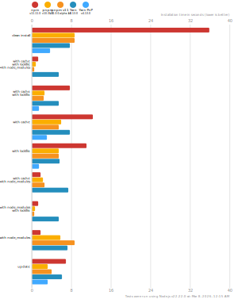

# Benchmarks of JavaScript Package Managers

**Last benchmarked at**: _Aug 12, 2021, 2:45 AM_ (_daily_ updated).

This benchmark compares the performance of npm, pnpm, and Yarn (both regular and PnP variant).

Here's a quick explanation of how these tests could apply to the real world:

- `clean install`: How long it takes to run a totally fresh install: no lockfile present, no packages in the cache, no `node_modules` folder.
- `with cache`, `with lockfile`, `with node_modules`: After the first install is done, the install command is run again.
- `with cache`, `with lockfile`: When a repo is fetched by a developer and installation is first run.
- `with cache`: Same as the one above, but the package manager doesn't have a lockfile to work from.
- `with lockfile`: When an installation runs on a CI server.
- `with cache`, `with node_modules`: The lockfile is deleted and the install command is run again.
- `with node_modules`, `with lockfile`: The package cache is deleted and the install command is run again.
- `with node_modules`: The package cache and the lockfile is deleted and the install command is run again.
- `update`: Updating your dependencies by changing the version in the `package.json` and running the install command again.

## Lots of Files

The app's `package.json` [here](https://github.com/pnpm/pnpm.github.io/blob/main/benchmarks/fixtures/alotta-files/package.json)

| action  | cache | lockfile | node_modules| npm | pnpm | Yarn | Yarn PnP |
| ---     | ---   | ---      | ---         | --- | ---  | ---  | ---      |
| install |       |          |             | 43.7s | 14.8s | 1m 1.4s | 49.1s |
| install | ✔     | ✔        | ✔           | 1.8s | 1.3s | 2.6s | n/a |
| install | ✔     | ✔        |             | 10.5s | 4s | 15s | 2.1s |
| install | ✔     |          |             | 16.2s | 6.9s | 22.3s | 8.1s |
| install |       | ✔        |             | 28.4s | 12.8s | 53.7s | 40.4s |
| install | ✔     |          | ✔           | 20s | 1.8s | 8.8s | n/a |
| install |       | ✔        | ✔           | 1.8s | 1.3s | 41.1s | n/a |
| install |       |          | ✔           | 20.1s | 6s | 46.8s | n/a |

