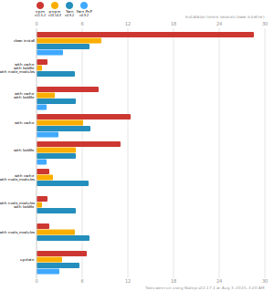

# Benchmarks of JavaScript Package Managers

**Last benchmarked at**: _Jan 3, 2022, 2:55 AM_ (_daily_ updated).

This benchmark compares the performance of npm, pnpm, Yarn Classic, and Yarn PnP (check [Yarn's benchmarks](https://yarnpkg.com/benchmarks) for any other Yarn modes that are not included here).

Here's a quick explanation of how these tests could apply to the real world:

- `clean install`: How long it takes to run a totally fresh install: no lockfile present, no packages in the cache, no `node_modules` folder.
- `with cache`, `with lockfile`, `with node_modules`: After the first install is done, the install command is run again.
- `with cache`, `with lockfile`: When a repo is fetched by a developer and installation is first run.
- `with cache`: Same as the one above, but the package manager doesn't have a lockfile to work from.
- `with lockfile`: When an installation runs on a CI server.
- `with cache`, `with node_modules`: The lockfile is deleted and the install command is run again.
- `with node_modules`, `with lockfile`: The package cache is deleted and the install command is run again.
- `with node_modules`: The package cache and the lockfile is deleted and the install command is run again.
- `update`: Updating your dependencies by changing the version in the `package.json` and running the install command again.

## Lots of Files

The app's `package.json` [here](https://github.com/pnpm/pnpm.github.io/blob/main/benchmarks/fixtures/alotta-files/package.json)

| action  | cache | lockfile | node_modules| npm | pnpm | Yarn | Yarn PnP |
| ---     | ---   | ---      | ---         | --- | ---  | ---  | ---      |
| install |       |          |             | 48.6s | 19.3s | 22.1s | 27.5s |
| install | ✔     | ✔        | ✔           | 2.1s | 1.4s | 2.6s | n/a |
| install | ✔     | ✔        |             | 13.5s | 4.1s | 8.6s | 1.9s |
| install | ✔     |          |             | 19.8s | 7.3s | 14.2s | 7.4s |
| install |       | ✔        |             | 31.8s | 13.8s | 15.3s | 21.1s |
| install | ✔     |          | ✔           | 2.7s | 1.7s | 8.3s | n/a |
| install |       | ✔        | ✔           | 2.1s | 1.3s | 9.4s | n/a |
| install |       |          | ✔           | 2.7s | 6.1s | 15s | n/a |
| update  | n/a | n/a | n/a | 2.2s | 12.1s | 18.7s | 32.4s |

## The reason pnpm is fast

Why is pnpm so crazy fast compared to other "traditional" package managers?

pnpm doesn't have blocking stages of installation. Each dependency has its own stages and the next stage starts as soon as possible.

